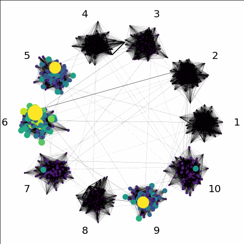

# A differentiable and on-the-fly adaptive shift-inverted Krylov solver

This repository contains a fully differentiable PyTorch compatible shift-and-invert Krylov time-propagator as well as Arnoldi algorithm. This package was used in the demonstration of the on-the-fly optimal shift selection procedure outlined in the article

M. Tennyson, T. Jawecki, S. Dolgov and P. Singh. "Optimal Poles for Shift-and-Invert Krylov Spaces".

The optimal poles are found by random initialisation at the first time step, followed by an optimisation-based routine that minimises an estimator of the local error. Specifically, we use a defect-based integral formulation that proves accurate even for long time-steps, and are able to use cheap surrogates to minimise optimisation overheads. The optimisation routing allows for a user-specified initial guess for the optimal pole; and overheads can be reduced if a good heuristic for the optimal pole is known — e.g. the optimal pole for the previous time-step.

The resulting procedure is able to achieve as good as an accuracy as a brute-force minimisation of true local error, with minimal overheads, and often allows taking time-steps that are much larger than a polynomial Krylov implementation. 

The current implementation is limited by PyTorch’s incompatibility with sparse matrices. Approaches to fix this limitation are currently under work. 

## Key Components

- `Krylov` folder containing key functions needed for shift and invert Krylov time integration; including the shift and invert Krylov time stepper, Arnoldi algorithm and optimisation routine for finding shifts.
- `example_01_graphs.ipynb` contains the code used for the first numerical example, in section 4.1 of the article. This example is based on the dynamics of graphs. Here the matrix to be exponentiated is formed of clusters of dense connectivity given by a dense block diagonal matrix, in addition to sparse interconnectivity between clusters.


- `example_02_Schrodinger.ipynb` contains the code used for the second numerical example, in section 4.2 of the article. This is a linear PDE example where the matrix to be exponentiated is a discretised Schrödinger-type Hamiltonian, with softened Coulomb potential and absorbing boundaries.


You can open both of these notebooks with this link [](https://mybinder.org/v2/gh/MarkTennysonNA/Shift-Invert_Krylov_Solver/HEAD).
## Dependencies

### Krylov package

- `pytorch`
- `scipy`
- `numpy`

### Graph example

- `tqdm`
- `matplotlib`
- `pickle`
- `networkx`

### Schrodinger example

- `matplotlib`

## Citation

If you use this repository for your research, please use the following citation, also provided in cite.bib:

```bibtex
@article{TJDS2024,
title = {Optimal Poles for Shift-and-Invert Krylov Methods},
author = {M. Tennyson and T. Jawecki and S. Dolgov and P. Singh}
}
```
